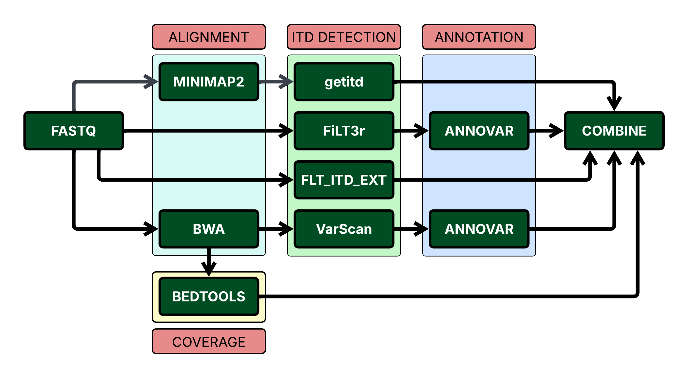

# FLT_MRD pipeline

## Introduction

**FLT3_MRD** is a modular, computational pipeline for detection of Minimal Residual Disease(MRD) in Acute Myeloid Leukemia. The pipeline is implemented in Nextflow. It aligns DNA sequencing reads to human hg19 reference genome and detects Internal Tandem Duplication(ITD) events in the FLT-3 gene. Coverage over target regions is calculated using bedtools. The pipeline integrates the results of ITD detection tools(getitd, FLT3_ITD_ext, FiLT3R and VarScan) as well as the coverage information, for each sample into a single spreadsheet. Additional outputs are sorted, indexed bam files. 

---

## Pipeline summary

<p align="center">

</p>

---

## Usage

The following parameters are required to be modified in the `params` section of the `nextflow.config` -

- *genome* = Complete path to the human genome fasta file. Make sure the FASTA index file and BWA & Minimap2 indices are present in the same genome folder 

- *annovar_db* = Complete path to the humandb database folder for ANNOVAR (refer https://annovar.openbioinformatics.org/en/latest/user-guide/startup/ )

---

## Running the pipeline

1. Transfer the `fastq.gz` files to the `sequences/` folder.

2. The samplesheet is `samplesheet.csv`. The sample_ids, without the file extension, should be mentioned in samplesheet in the following format-
sample1
sample2
sample3
Please check for empty lines in the samplesheet before running the pipeline.


3. The pipeline can be run by running the command-

```bash
nextflow run FLT3_MRD.nf -entry FLT3_MRD -profile docker -resume -bg
```

---

## Output
The outputs are saved in `Final_output/` folder.

