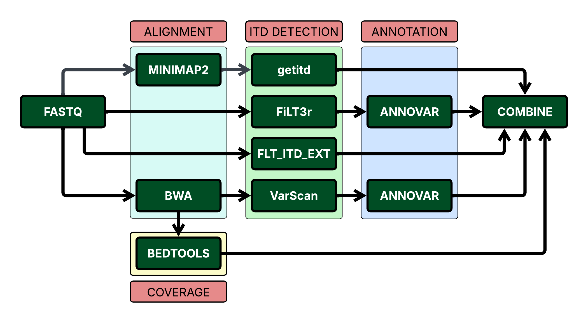

# LSC_FLT3_MRD pipeline

## Detection of AML MRD by FLT3 ITD detection


## Table of Contents

1. [Introduction](#introduction)
2. [Pipeline summary](#pipeline-summary)
3. [Pipeline structure](#pipeline-structure)
4. [Usage](#usage)
5. [Requirements](#requirements)
5. [Running the pipeline](#running-the-pipeline)
6. [Output](#output)
7. [Citation](#citation)

---

## Introduction

**LSC_FLT3_MRD** is a modular, computational pipeline for detection of Minimal Residual Disease(MRD) in Acute Myeloid Leukemia, by detecting Internal Tandem duplications in FLT3 gene.  One-step PCR assay was performed to target exons 14 and 15 of the FLT3 gene. DNA libraries were sequenced on NextSeq paltform, with 2X250 read size. Each sample was allocated 1.5-2 million reads. <br>
The pipeline is implemented in Nextflow. It aligns DNA sequencing reads to human hg19 reference genome and detects Internal Tandem Duplication(ITD) events in the FLT-3 gene. Coverage over target regions is calculated using bedtools. The pipeline integrates the results of ITD detection tools (getitd, FLT3_ITD_ext, FiLT3R and VarScan) as well as the coverage information, for each sample into a single spreadsheet. Additional outputs are sorted, indexed bam files. 

---

## Pipeline summary

<p align="center">

</p>

---

## Pipeline structure

The major contents of the pipeline include - 

```
assets/			# Folder containing reference files
bin/			# Folder with scripts called in the pipeline
modules/		# Folder containing individual process descriptions
sequences/		# Input sequences
FLT3_MRD.nf		# Nextflow file defining the pipeline
nextflow.config	# File describing input parameters and computing resources for individual processes
samplesheet.csv # text file containing sample IDs

```
---

## Usage

The pipeline can be downloaded using the command - 

```
git clone https://github.com/patkarlab/LSC_FLT3_MRD.git

cd LSC_FLT3_MRD/

```
## Requirements
The human reference genome files as well as databases for ANNOVAR need to be downloaded and placed in the `./assets` folder. Reference genome fasta needs to be indexed for *BWA*  and *Minimap2* as per the tool recommendation, and the index files should be present in same folder containing the Reference genome fasta. Additionally, the bed file for the target regions should also be present in the `./assets` directory. If the required files are present in any other location, please modify the following parameters in the `params` section of the `nextflow.config` file -


| Parameter              | Description |
|------------------------|-------------|
| *genome*               | Human genome FASTA file (hg19_all.fasta). Ensure the FASTA index file (hg19_all.fasta.fai) and BWA index files (hg19_all.fasta.amb, hg19_all.fasta.ann, hg19_all.fasta.bwt, hg19_all.fasta.pac, hg19_all.fasta.sa) are present in the same folder. |
| *filt3r_ref*           | Path to FiLT3r reference FASTA (flt3_exon14-15.fa). This file is present in the FiLT3R repository, or it can be downloaded from https://gitlab.univ-lille.fr/filt3r/filt3r/-/tree/master/data?ref_type=heads |
| *genome_minimap_getitd* | Human reference genome for Minimap2 (hg37.fa) along with its index (hg19_all.fasta.map-ont.mmi). |
| *bedfile*             | BED file containing the target regions. |
| *annovar_db*          | Complete path to the humandb database folder for ANNOVAR (https://annovar.openbioinformatics.org/en/latest/user-guide/startup/). |

---

The list of adaptors required by Trimmomatic, `NexteraPE-PE.fa` & `TruSeq2-PE.fa` are placed in the `./assets` folder. Additionally, the `--forward-adaptor` and the `--reverse-adaptor` parameters would need to be modified in the getitd process, if needed. 

---
## Running the pipeline

1. Transfer the sequencing files in `fastq.gz` format to the `sequences/` folder.

2. The samplesheet is `samplesheet.csv`. The sample ID, without the file extension (for example, for sample 'sample1_S45_R2_001.fastq.gz', sample ID will be 'sample1'), should be mentioned in samplesheet in the following format - <br>
sample1<br>
sample2<br>
sample3<br>
Please check for empty lines in the samplesheet before running the pipeline.


3. The pipeline can be executed with the following command -

```
nextflow run FLT3_MRD.nf -entry FLT3_MRD -profile docker -resume -bg

```

---

## Output
The outputs are saved in `Final_output/` folder.

1. The main output generated is sample.xlsx file. It is a multisheet spreadsheet containing the following - <br>
Sheet1 - ITDs detected by all 3 ITD calling tools. <br>
Sheet2 - FLT3_ITD_ext output <br>
Sheet3 - getitd output <br>
Sheet4 - FiLT3R output generated from FiLT3R json file <br>
Sheet5 - Annovar annotated Filt3r vcf <br>
Sheet6 - annovar annotated Varscan vcf <br>
Sheet7 - coverage over targetted regions <br>

2. The complete getitd output folder -  <br>
sample1_getitd/ <br>

3. Other output is sorted and indexed bam file. <br>
sample.bam <br>
sample.bam.bai <br>

---

## Citation
If you use this pipeline in your research, please cite:
```
Leukemic stem cell MRD refines relapse-risk beyond conventional FCM and NGS-based approaches in intensively treated AML. 2026
```
---

## Contact
[Patkarlab](https://github.com/patkarlab)
